# Diablo IV Companion

### Readme translations

Una aplicación complementaria para Diablo IV que te ayudará a encontrar los accesorios de equipo perfectos.

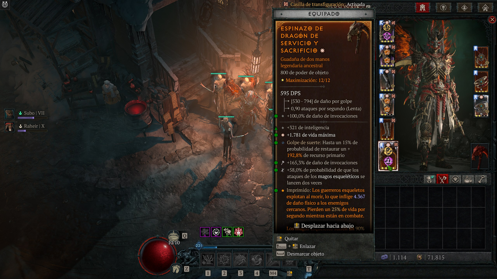
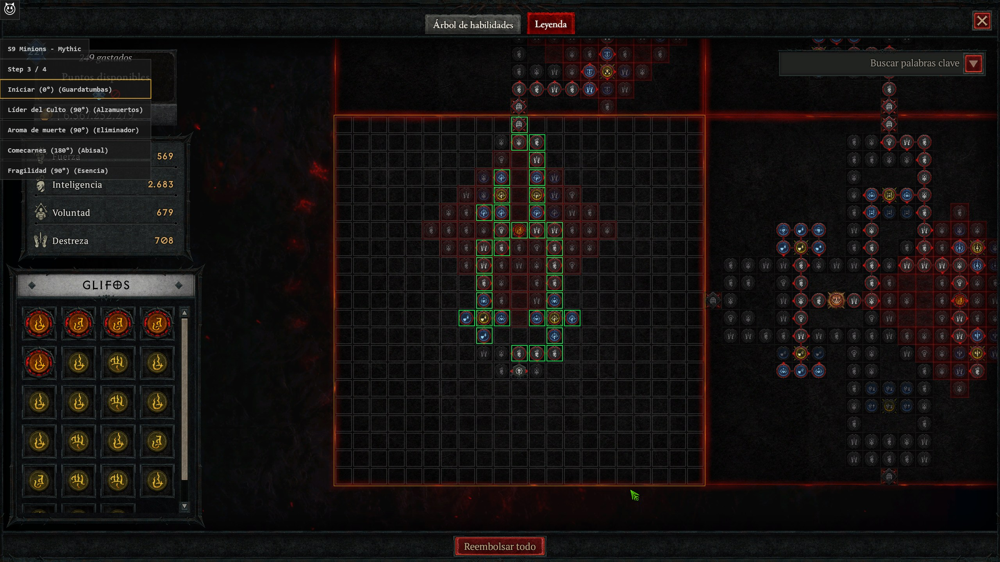
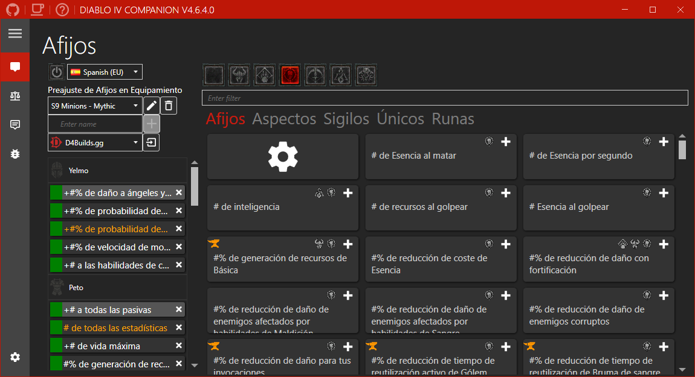
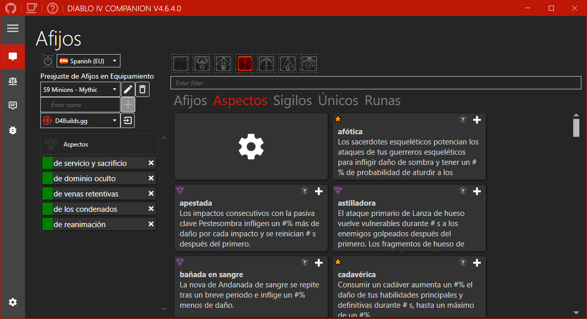
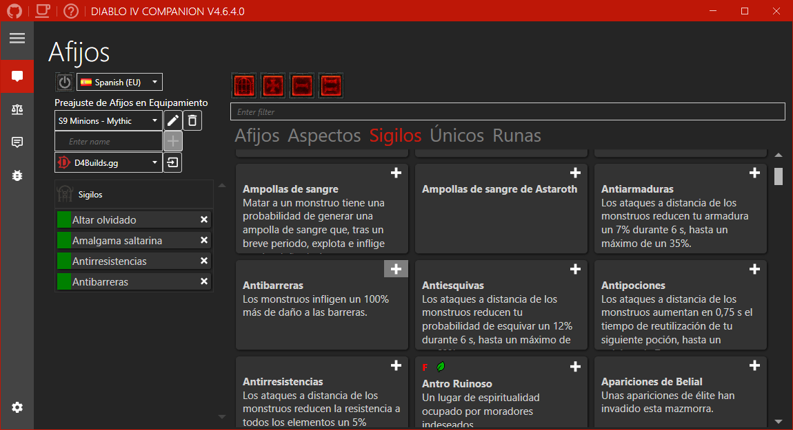
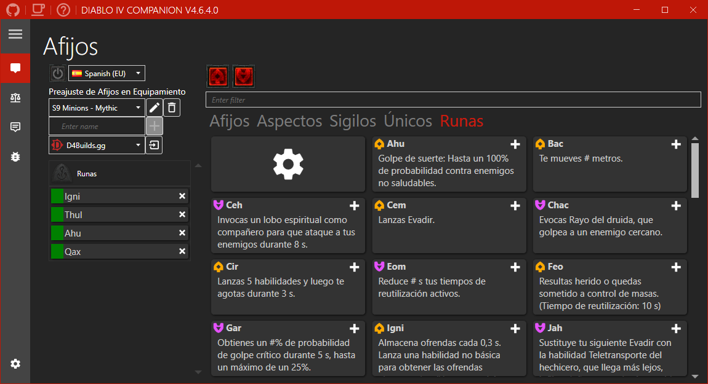
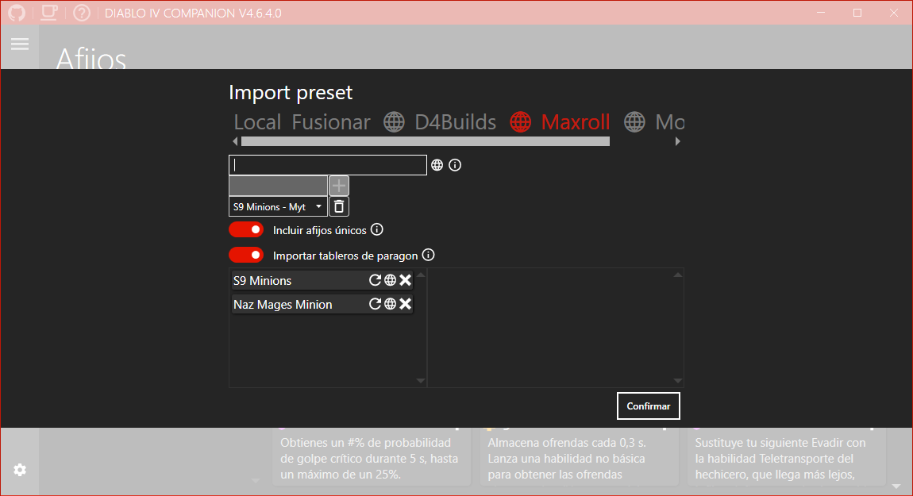
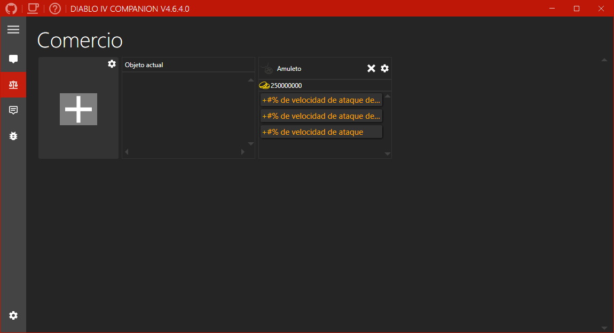

Si te gusta mi trabajo puedes apoyarme en Ko-fi.

¿Necesita ayuda?

## Índice

- [Características](https://github.com/josdemmers/Diablo4CompanionREADME.esES.md#características)
- [Instalación](https://github.com/josdemmers/Diablo4CompanionREADME.esES.md#Instalación)
- [Configuraciones](https://github.com/josdemmers/Diablo4CompanionREADME.esES.md#Configuraciones)
- [Uso](https://github.com/josdemmers/Diablo4CompanionREADME.esES.md#Uso)
- [Solución de problemas](https://github.com/josdemmers/Diablo4CompanionREADME.esES.md#solución-de-problemas)

## Características

- Filtro de loot.
  - Soporte para afijos, aspectos, runas y sigilos.
  - Filtrar por valor de afijo.
  - Filtrar por potencia de objeto.
- Listas de comercio
  - Rastrea objetos valiosos para comerciar.
  - Mostrar el valor comercial dentro del juego.  
- Importar builds de D4Builds.gg
- Importar builds de Maxroll.gg
- Importar Builds de Mobalytics.gg
- Importar tableros paragon. Mira [wiki](https://github.com/josdemmers/Diablo4Companion/wiki/How-to-use-the-paragon-overlay).
- Soporte multilingüe. Mira [wiki](https://github.com/josdemmers/Diablo4Companion/wiki/How-to-create-translations) si quieres traducir la aplicación. 

## Instalación

- Descarga la versión más reciente en [Releases](https://github.com/josdemmers/Diablo4Companion/releases)
- Extrae los archivos y ejecuta D4Companion.exe
- Ve a ajustes y selecciona el **Preajuste del sistema** que coincida con tu resolución.
  - Asegúrese de hacer clic en el botón de actualización/descarga para obtener la última versión..
  - Utiliza los ajustes recomendados para cada resolución.
- Ve a Afijos y crea un nuevo **Preajuste de Afijos en Equipamiento**..
  - O importar una Builds de D4Builds, Maxroll o Mobalytics ([wiki](https://github.com/josdemmers/Diablo4Companion/wiki/How-to-import-and-export-builds)).
- Selecciona tus afijos preferidos para cada ranura de objeto.
- Haz doble clic en los afijos para añadirlos/eliminarlos de la lista.
- Lee [Uso](https://github.com/josdemmers/Diablo4CompanionREADME.esES.md#Uso) para más información sobre el uso de la aplicación.
- Para consejos y solución de problemas también hay una [wiki](https://github.com/josdemmers/Diablo4Companion/wiki).

## Configuraciones

Actualmente se incluyen los siguientes preajustes del sistema:

| Preajuste           | Idiomas                                       | Config                                                                      |  Status                                                           | Iconos Faltantes           |
| ---------------- | ----------------------------------------------- | --------------------------------------------------------------------------- | ----------------------------------------------------------------- | ----------------------- |
| 1080p_SMF        |  | SDR (HDR off) con la fuente establecida en medio.              |   |                         |
| 1080p_SSF        |  | SDR (HDR off) con la fuente establecida en pequeña.               |   |                         |
| 1440p_HSF        |  | HDR con la fuente establecida en pequeña.                         |   |                         |
| 1440p_SMF        |  | SDR (HDR off) con la fuente establecida en medio.              |   |                         |
| 1440p_SMF_zhCN   |  | SDR (HDR off) con la fuente establecida en medio para el idioma Chino (Simplificado). |   |                         |
| 1440p_SSF        |  | SDR (HDR off) con la fuente establecida en pequeña.               |   |                         |
| 1600p_SMF        |  | SDR (HDR off) con la fuente establecida en medio.              |    | Mejores, Templado, Miticos, Runas |
| 1600p_SMF_zhCN   |  | SDR (HDR off) con la fuente establecida en medio para el idioma Chino (Simplificado). |    | Mejores, Templado, Miticos, Runas |
| 2160p_HSF        |  | HDR con la fuente establecida en pequeña.                         |   |                         |
| 2160p_SSF        |  | SDR (HDR off) con la fuente establecida en pequeña.               |   |                         |

Cada preajuste funciona tanto para resoluciones normales como panorámicas. Por ejemplo, para 2560x1440 y 3440x1440 utiliza el preajuste 1440p.

No dudes en compartir tus preajustes de sistema conmigo para que pueda añadirlos a la aplicación.

Consulte la siguiente [wiki](https://github.com/josdemmers/Diablo4Companion/wiki/How-to-create-a-new-System-Preset) para crear tu propio Preajuste.

## Uso

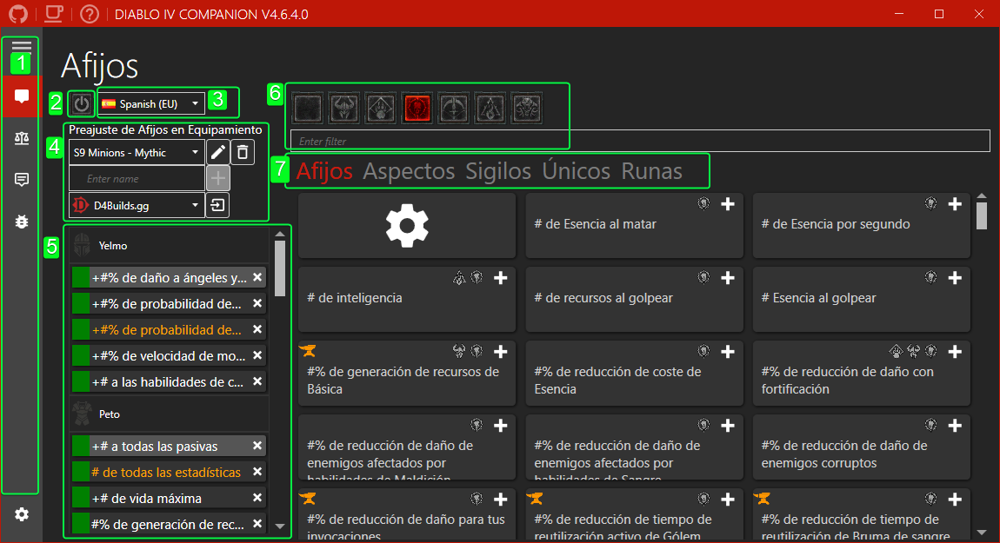

1. Menú de navegación. En el siguiente orden, Afijos, Comercio, Registro, Debug y Configuración.
2. Activa y desactiva el Overlay. Nota: Esto también es posible utilizando el botón dentro del juego en la esquina superior izquierda.
3. Cambiar el idioma de los afijos.
4. Crea, selecciona o elimina preajustes de afijos. Los botones de importación/exportación se pueden utilizar para compartir tus Builds, o para importar Builds de D4Builds, Maxroll y Mobalitics. Ver [wiki](https://github.com/josdemmers/Diablo4Companion/wiki/How-to-import-and-export-builds) Para mas detalles.
5. Resumen de los afijos seleccionados para cada ranura de equipación. Haga clic para cambiar el color o haga doble clic en el nombre del accesorio para eliminarlo.
6. Filtrar afijos.
7. Cambia entre afijos, aspectos, sigilos, únicos y runas.
8. Añade el afijo a tu preset para que puedas controlarlo dentro del juego.

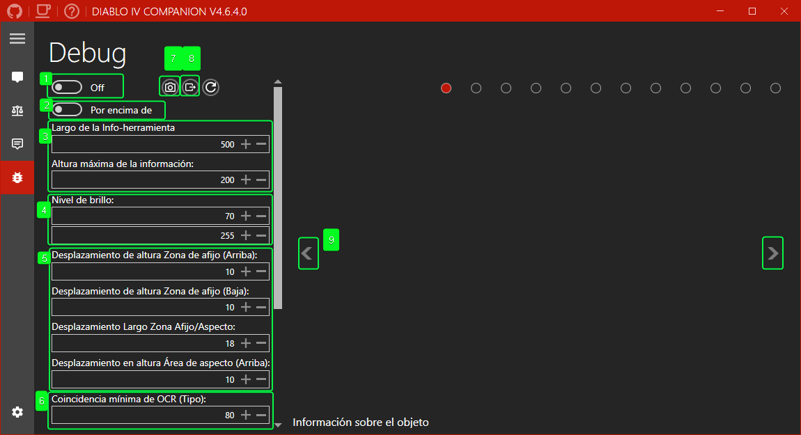

1. Activa o desactivar la información de depuración.
2. Establecer la aplicación como ventana superior.
3. Establece el ancho de la información sobre herramientas. Por defecto para 1440p es 500. Los ajustes recomendados para otras resoluciones aparecen en la lista cuando se descarga un preajuste del sistema y se aplican automáticamente cuando se selecciona otro preajuste. El ajuste de altura se utiliza para limitar el área del tipo de elemento de la información sobre herramientas.
4. Ajustes de umbral para filtrar la imagen borrosa. El valor predeterminado para SDR es (70/255). Los ajustes recomendados para HDR aparecen cuando se descarga un preajuste del sistema y se aplican automáticamente cuando se selecciona otro preajuste.
5. Desplazamientos de área para descripciones de afijos/aspectos. Los ajustes recomendados para cada resolución se enumeran al descargar un preajuste del sistema y se aplican automáticamente al seleccionar otro preajuste.
6. Coincidencia mínima aceptable para el texto convertido mediante OCR. Por defecto es 80%.
7. Haz una captura de pantalla.
8. Vuelve a cargar el preajuste del sistema activo actual.
9. Imagen de depuración anterior.
10. Siguiente imagen de depuración.
11. Umbrales de similitud para comparar imágenes. Un valor más bajo significa que se requiere una coincidencia más estrecha. Se recomienda un valor por defecto de 0,05.

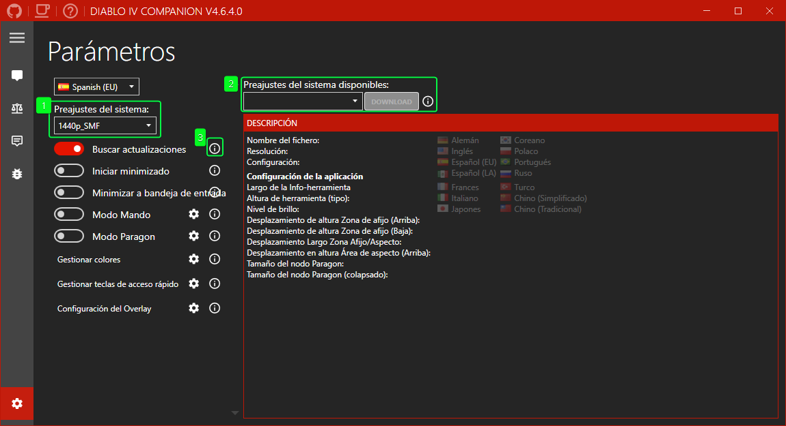

1. Seleccione el preajuste que corresponda a su resolución. Consulta [wiki](https://github.com/josdemmers/Diablo4Companion/wiki/How-to-create-a-new-System-Preset) para crear el tuyo..
2. El gestor de descargas puede utilizarse para descargar preajustes del sistema creados por la comunidad. Si falta tu idioma o resolución, envíamelos y los añadiré a la lista. Sigue la configuración recomendada de la aplicación en la descripción.
3. Pase el ratón por encima de uno de los iconos de información para obtener información más detallada sobre un ajuste.

## Solución de problemas

Mira [F.A.Q.](https://github.com/josdemmers/Diablo4Companion/wiki#frequently-asked-questions)

## Licencia

MIT

## Paquetes de terceros

- [CsWin32](https://github.com/microsoft/CsWin32)
- [Emgu CV](https://www.emgu.com/wiki/index.php/Main_Page)
- [FuzzierSharp](https://github.com/AtriaStar/FuzzierSharp)
- [GameOverlay.Net](https://github.com/michel-pi/GameOverlay.Net)
- [Hardcodet WPF NotifyIcon](https://github.com/hardcodet/wpf-notifyicon)
- [MahApps.Metro](https://github.com/MahApps/MahApps.Metro)
- [NHotkey](https://github.com/thomaslevesque/NHotkey)
- [TesseractOCR](https://github.com/Sicos1977/TesseractOCR)

## Comunidad

### The Hidden Gaming Lair

- [Discord](https://th.gl/discord)
- [www](https://www.th.gl/)

## Menciones

- [d4data](https://github.com/DiabloTools/d4data)
- [d4builds.gg](https://d4builds.gg/)
- [maxroll.gg](https://maxroll.gg/d4/build-guides)
- [mobalitics.gg](https://mobalytics.gg/diablo-4)
