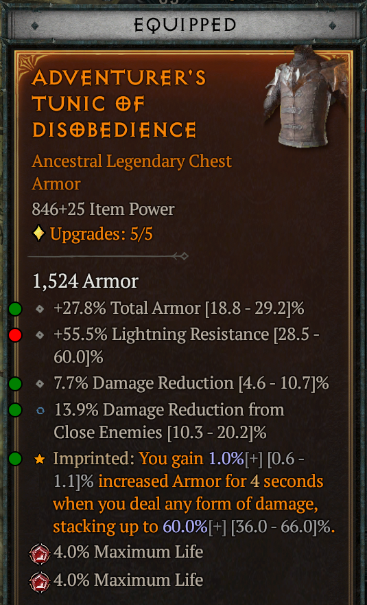
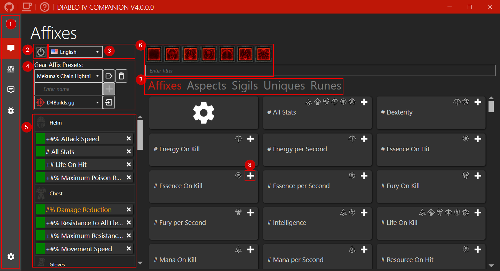
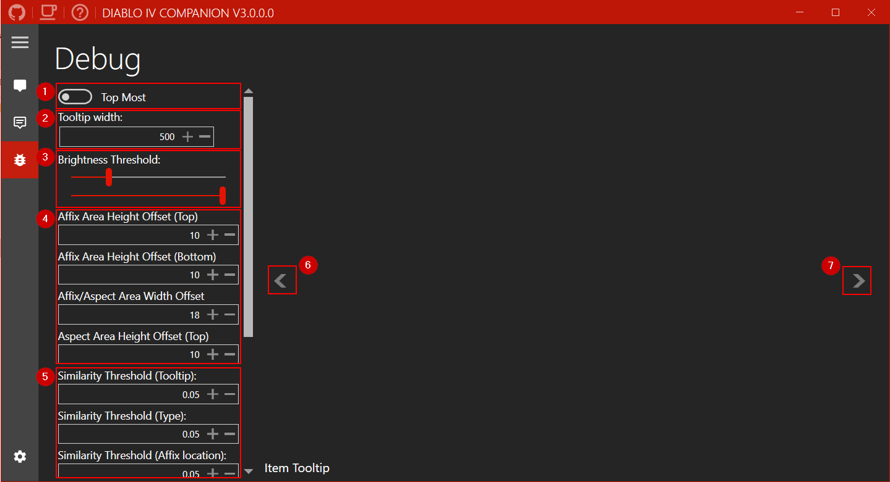
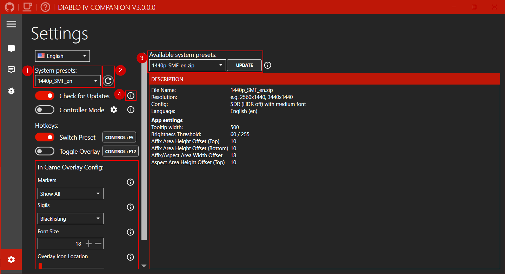

# Diablo IV Companion - The Inventory Manager 

A companion app for Diablo IV, to make life easier in finding the correct affixes.

```diff
+ Looking for system presets for the download manager, let me know when you want to share them. All different languages and resolutions are welcome.
```



If you like my work you can sponsor me on Ko-fi.

[](https://ko-fi.com/H2H1H5GCR)

## Table of Contents

- [Features](https://github.com/josdemmers/Diablo4Companion#features)
- [Installation](https://github.com/josdemmers/Diablo4Companion#installation)
- [Configuration](https://github.com/josdemmers/Diablo4Companion#configuration)
- [Usage](https://github.com/josdemmers/Diablo4Companion#Usage)
- [Troubleshooting](https://github.com/josdemmers/Diablo4Companion#Troubleshooting)

## Features

- Specify your prefered affixes for each gear slot and monitor them ingame.

## Installation

- Download the latest version from [Releases](https://github.com/josdemmers/Diablo4Companion/releases)
- Extract files and run D4Companion.exe
  - Go to settings and select the **System preset** matching your resolution.
  - Go to affixes and create a new **Gear Affix Preset**.
  - Select your prefered affixes for each item slot.
  - Read [Usage](https://github.com/josdemmers/Diablo4Companion#Usage) for more details on using the app.

## Configurations

Currently the following system presets are included:
- 1050p_SMF_en: SDR (HDR off) with font set to medium for the English language.
- 1080p_SMF_en: SDR (HDR off) with font set to medium for the English language.
- 1440p_SMF_en: SDR (HDR off) with font set to medium for the English language.
- 1440p_HSF_en: HDR with font set to small for the English language.
- 1600p_SMF_zh-CN: SDR (HDR off) with font set to medium for the Chinese (Simplified) language.
- 2160p_HSF_en: HDR with font set to small for the English language.

Each preset works for both normal and widescreen resolutions. e.g. for 2560x1440 and 3440x1440 use the 1440p preset.

Feel free to share you system presets with me so I can add them to the app.

See the following [wiki](https://github.com/josdemmers/Diablo4Companion/wiki/How-to-create-a-new-System-Preset) page to create your own.

## Usage



1. Navigation menu. In the following order, Affixes, Logging, Debug, and Settings.
2. Change language for affixes.
3. Create, select, or delete affix presets.
4. Toggle the overlay on/off. Note: This is also possible using the ingame button in the top left corner.
5. Overview of selected affixes for each gear slot. Click to change color, or double click affix name to remove it.
6. Filter affixes.
7. Switch between affixes, aspects, and sigils.
8. This red warning icon means the image for the affix is missing.
9. Select which image(s) this affix should use.
10. Adds the affix to your preset so you can monitor it ingame.



1. Set the width of the tooltip. Default for 1440p is 500.
2. Threshold sliders for filtering out background noise. Defaults should be fine (60/255).
3. Similarity thresholds for matching images. A lower value means a closer match is required. Default of 0.05 is recommended.
4. Previous debug image.
5. Next debug image.



1. Select the preset matching your resolution. See [wiki](https://github.com/josdemmers/Diablo4Companion/wiki/How-to-create-a-new-System-Preset) to create your own.
2. Reload the preset. Useful after adding new images without restarting the app.
3. The download manager can be used to download community created system presets. If your language or resolution is missing please send them to me and I'll add them to the list.
4. Hover your mouse over one of the info icons to get more detailed information about a setting.

## Troubleshooting

See [F.A.Q.](https://github.com/josdemmers/Diablo4Companion/wiki#frequently-asked-questions)

## Licensing

MIT

## Thirdparty packages

- [Emgu CV](https://www.emgu.com/wiki/index.php/Main_Page)
- [GameOverlay.Net](https://github.com/michel-pi/GameOverlay.Net)
- [MahApps.Metro](https://github.com/MahApps/MahApps.Metro)
- [NHotkey](https://github.com/thomaslevesque/NHotkey)
- [PInvoke](https://github.com/dotnet/pinvoke)
- [Prism](https://github.com/PrismLibrary/Prism)

## Community

### The Hidden Gaming Lair

- [Discord](https://discord.gg/NTZu8Px)
- [www](https://www.th.gl/)

## Disclaimer

This app does not interact with Diablo IV, everything is done using image recognition. However use at your own risk.
