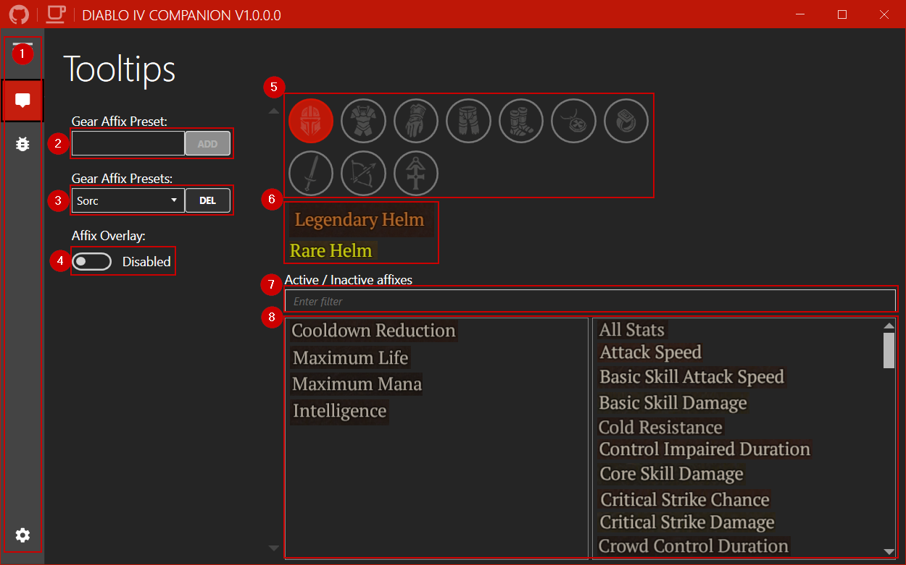
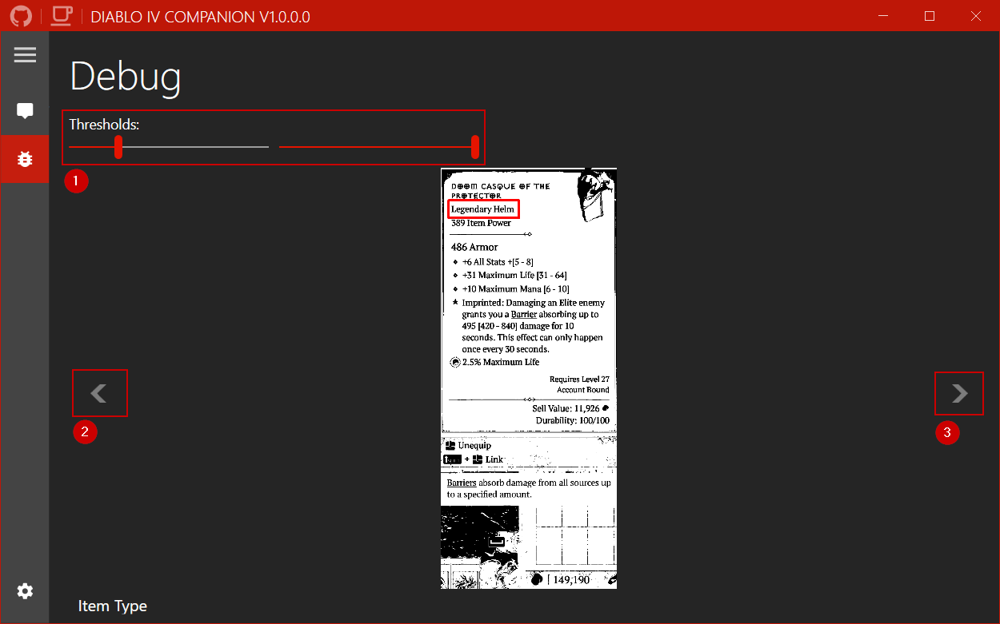
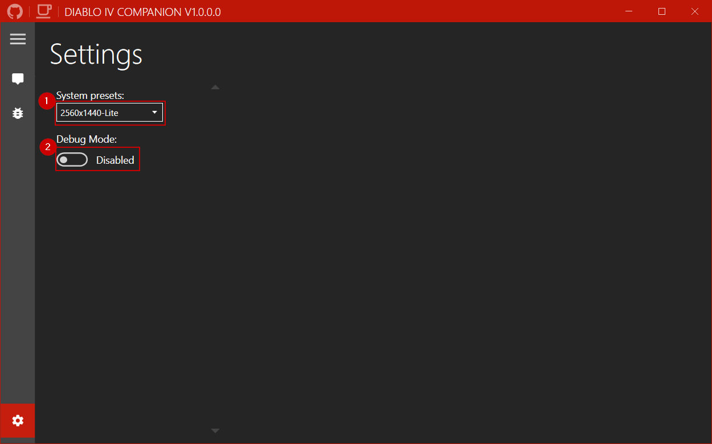

# Diablo IV Companion - The Inventory Manager 

A companion app for Diablo IV, to make life easier in finding the correct affixes.

If you like my work you can sponsor me on Ko-fi.

## Table of Contents

- [Features](https://github.com/josdemmers/Diablo4Companion#features)
- [Installation](https://github.com/josdemmers/Diablo4Companion#installation)
- [Configuration](https://github.com/josdemmers/Diablo4Companion#configuration)
- [Usage](https://github.com/josdemmers/Diablo4Companion#Usage)
- [Troubleshooting](https://github.com/josdemmers/Diablo4Companion#Troubleshooting)

## Features

- Specify your prefered affixes for each gear slot and monitor them ingame.

## Installation

- Download the latest version from [Releases](https://github.com/josdemmers/Diablo4Companion/releases)
- Extract files and run D4Companion.exe
  - Go to settings and select the **System preset** matching your resolution.
  - Go to tooltips and create a new **Gear Affix Preset**.
  - Select your prefered affixes for each item slot.
    - Double click affixes to add/remove them from the list.
  - Read [Usage](https://github.com/josdemmers/Diablo4Companion#Usage) for more details on using the app.

## Configurations

Because the app uses image recognition different configurations are needed for each resolution and color setting.
New configurations can be added in `.\D4Companion\Images\`, for example `.\D4Companion\Images\2560x1440\`.

The easiets way to create the new images is by pressing `Shift + Windows Key + S`. Then use the snipping tool to capture a part of your screen.

### Performence

For each configuration there is also a `Lite` mode. This groups all weapons and damage dealers together, including the offhand Focus.

| Configuration | Description |
| ------------- | ----------- |
| 2560x1440 | Slower config. Weapons and Focus separated |
| 2560x1440-Lite | Recommended. Weapons and offhand Focus all grouped together. |

The `Lite` mode is roughly 100ms faster. Only when you realy want to set different affixes for both weapons and focus I would recommend to use the other config.

## Usage

1. Navigation menu. In the following order, Tooltips, Debug, and Settings.
2. Add a new preset for your preferred affixes.
3. Select or delete an existing affix preset.
4. Toggle the overlay on/off. Note: This is also possible using the ingame button in the top left corner.
5. Selected gear slot for which you want to set the affixes.
6. Used item types for the selected gear slot.
7. Filter available affixes.
8. List of all available affixes. Use double click to add/remove them from the list.

1. Threshold sliders for filtering out background noise. Defaults should be fine (60/255).
2. Previous debug image.
3. Next debug image.

1. Select the preset matching your resolution. See [Configuration](https://github.com/josdemmers/Diablo4Companion#configuration) to create your own.
2. Toggle debug mode on/off. Should remain off. Allows you to use screenshots instead of running Diablo to do some testing.

## Troubleshooting

## Licensing

MIT

## Thirdparty packages

- [Emgu CV](https://www.emgu.com/wiki/index.php/Main_Page)
- [GameOverlay.Net](https://github.com/michel-pi/GameOverlay.Net)
- [MahApps.Metro](https://github.com/MahApps/MahApps.Metro)
- [PInvoke](https://github.com/dotnet/pinvoke)
- [Prism](https://github.com/PrismLibrary/Prism)

## Community

### The Hidden Gaming Lair

- [Discord](https://discord.gg/NTZu8Px)
- [www](https://www.th.gl/)

